# EDU Platform — Система онлайн-образования

**Проект** — пример комплексной платформы онлайн-курсов, построенной на базе JPA/Hibernate, Spring Boot и PostgreSQL, с полной реализацией управления образовательным процессом.

## Возможности платформы

- **Управление пользователями**: студенты, преподаватели, администраторы
- **Каталог и создание курсов**: формирование, настройка и управление курсами
- **Структурирование программы**: поддержка модулей, уроков, заданий для каждого курса
- **Тестирование знаний**: реализация викторин с вопросами и вариантами ответов
- **Записи на курсы**: поддержка Many-to-Many связей между студентами и курсами
- **Оценивание**: проверки, выставление оценок по заданиям
- **Отзывы, рейтинги и обратная связь**


## Структура проекта

```
src/main/java/ru/educationplatform/
├── entity/          # JPA-сущности
├── repository/      # Репозитории
├── service/         # Сервисный слой
├── controller/      # REST-контроллеры
└── config/          # Конфиг приложения

src/test/java/ru/educationplatform/
└── EducationPlatformIntegrationTest.java
```

## Используемые технологии

- **Java 17**
- **Spring Boot 3.2.0**
- **Spring Data JPA**
- **Hibernate**
- **PostgreSQL**
- **Testcontainers** (интеграционные тесты)
- **Gradle** (автоматическая сборка)

## Особенности архитектуры

- **Ленивая загрузка**: Все связи реализованы с FetchType.LAZY
- **Валидация**: Входные данные проверяются аннотациями (`@NotBlank`, `@Email`, `@Min`, `@Max`)
- **Обработка ошибок**: Глобальный обработчик исключений возвращает JSON-ответы
- **Транзакции**: Сервисы используют `@Transactional` для целостности данных


## Основные сущности и модель данных
- **User** - пользователи системы
- **Profile** - профиль пользователя
- **Category** - категории курсов
- **Course** - учебные курсы
- **Enrollment** - записи студентов на курсы 
- **Module** - модули курсов
- **Lesson** - уроки в модулях
- **Assignment** - задания
- **Submission** - решения заданий
- **Quiz** - тесты
- **Question** - вопросы тестов
- **AnswerOption** - варианты ответов
- **QuizSubmission** - результаты тестов
- **CourseReview** - отзывы о курсах
- **Tag** - теги курсов

Все ассоциации реализованы с ленивой загрузкой (`FetchType.LAZY`).

### ER-диаграмма


## Инструкция по установке и запуску

### Необходимое ПО

- Java 17+
- Gradle (или Gradle Wrapper)


### Быстрый запуск (mode: demo)

#### 1. Использовать H2 (встроенная БД, без доп. установки):

```bash
./gradlew bootRun --args='--spring.profiles.active=h2'
```


#### 2. Использовать PostgreSQL (рекомендуется для реального использования):

- **С Docker Compose:**

```bash
docker-compose up -d
docker-compose up postgres -d      # Только БД
```

- **Втручную:**

```sql
CREATE DATABASE education_platform;
CREATE USER postgres WITH PASSWORD 'postgres';
GRANT ALL PRIVILEGES ON DATABASE education_platform TO postgres;
```

```bash
./gradlew bootRun
```


### Сборка и тестирование

```bash
./gradlew build         # Сборка
./gradlew test          # Запуск тестов
./gradlew clean build   # Полная сборка с тестами
```

Приложение будет доступно на: `http://localhost:8080`

### H2 Console для быстрой проверки схемы

- URL: `http://localhost:8080/h2-console`
- JDBC: `jdbc:h2:mem:testdb`
- Пользователь: `sa` (пароль не требуется)


## Документация по REST API

### Курсы

- **Создать курс:**
`POST /api/courses?title=Java Basics&description=Learn Java&categoryId=1&teacherId=1`
- **Получить курс:**
`GET /api/courses/{id}`
`GET /api/courses/{id}/with-modules`
- **Список курсов:**
`GET /api/courses`
`GET /api/courses/category/{categoryId}`
`GET /api/courses/teacher/{teacherId}`
- **Добавить модуль:**
`POST /api/courses/{courseId}/modules?title=Module 1&orderIndex=1`


### Запись на курсы

- **Записать студента:**
`POST /api/enrollments?courseId=1&studentId=1`
- **Отписать от курса:**
`DELETE /api/enrollments?courseId=1&studentId=1`
- **Список курсов студента:**
`GET /api/enrollments/student/{studentId}/courses`


### Работа с заданиями

- **Создать задание:**
`POST /api/assignments?lessonId=1&title=Homework&description=Task description&dueDate=2024-12-31&maxScore=100`
- **Отправить решение:**
`POST /api/assignments/{assignmentId}/submit?studentId=1&content=Solution text`
- **Оценить работу:**
`PUT /api/assignments/submissions/{submissionId}/grade?score=95&feedback=Good work!`


### Тестирование

- **Создать тест:**
`POST /api/quizzes?moduleId=1&title=Quiz&timeLimit=30`
- **Добавить вопрос:**
`POST /api/quizzes/{quizId}/questions?text=Question text&type=SINGLE_CHOICE`
- **Добавить вариант ответа:**
`POST /api/quizzes/questions/{questionId}/options?text=Answer&isCorrect=true`
- **Пройти тест:**
`POST /api/quizzes/{quizId}/take?studentId=1`


## Демо-данные

Система автоматически заполняет базу примерами: преподаватель, два студента, категории, курсы, заполненные модули, задания, тесты, и отзывы.

## Тестирование

- Для запуска тестов:

```bash
./gradlew test
```

- Интеграционные тесты используют Testcontainers и покрывают создание, ленивую загрузку, обработку ошибок и основные бизнес-сценарии.


## Docker и CI/CD

- **Docker**: В комплекте Dockerfile и docker-compose для быстрой миграции и запуска приложения

```bash
docker-compose up -d
docker-compose down
```

- **CI/CD**: GitHub Actions для автоматической сборки, тестирования и отчетности


